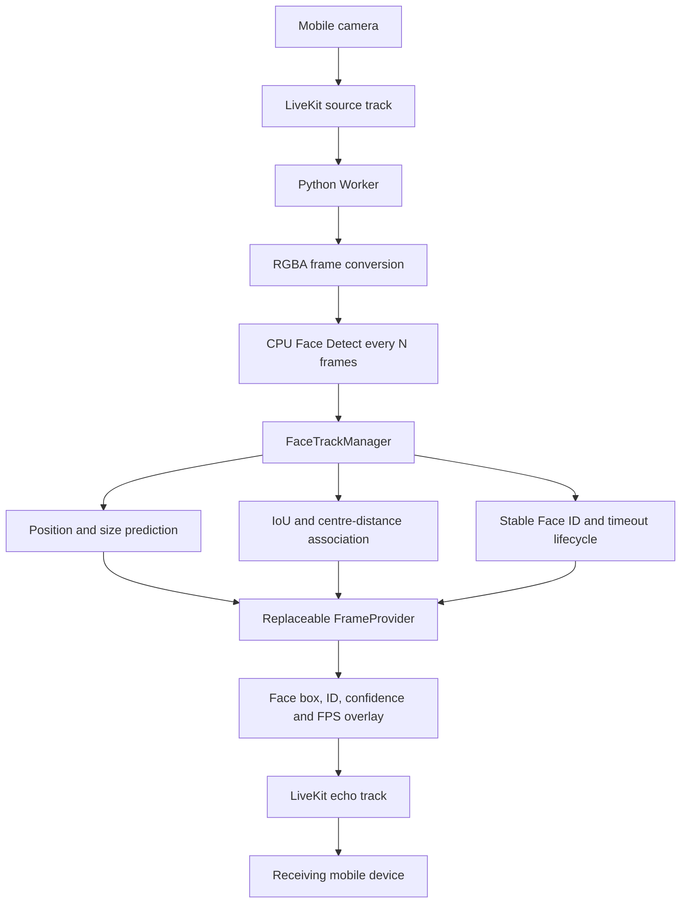

# Face Track Architecture

Face tracking is isolated from LiveKit transport and face detection. The manager accepts
either a detection list or `None` for a non-detection frame, making it replaceable without
changing room connection, publication, or future inference code.

`FrameProvider` is a separate asynchronous interface receiving an RGBA frame plus an
immutable `FrameProcessingContext` containing room, participant, frame number and current
tracks. The active provider is selected by `FRAME_PROVIDER`. This phase registers only
`passthrough`; a future local or remote model must implement the interface and be added to
the registry without importing it into `FaceTrackManager`.

No Face Swap, CUDA, PyTorch, GPU, RunPod, FaceFusion, InsightFace, or Deep-Live-Cam code is
included in this phase.
